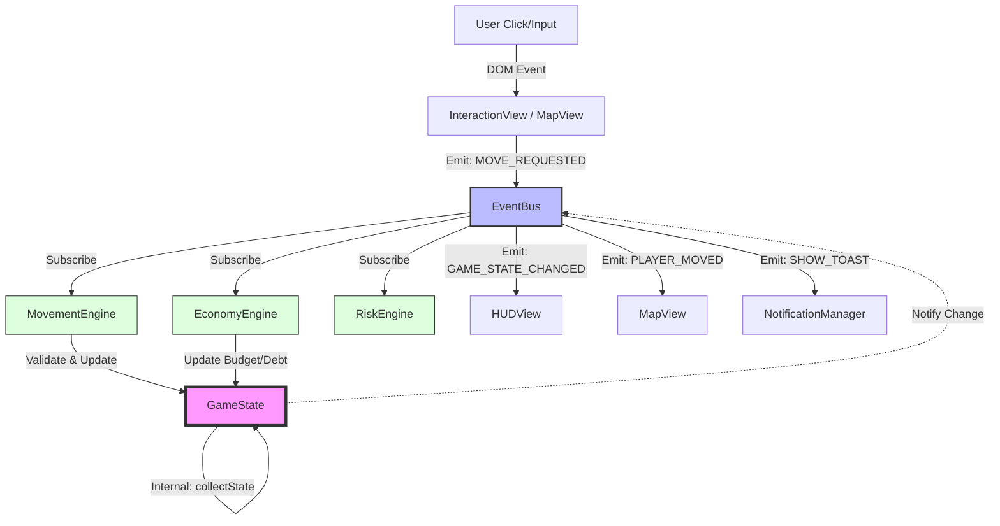

# 🔬 GridCrime — System Audit & Architektur-Review (Schritt 1)

Basierend auf der Analyse der aktuellen Codebase (TingelTangel / GridCrime) wurde folgendes System-Audit durchgeführt. Dieses Dokument dient als Grundlage für die anstehenden Refactoring- und Bugfixing-Phasen.

## 🏛 Aktuelle Architektur-Zusammenfassung

Das Projekt befindet sich in einem Übergang von einem monolithischen Design hin zu einer Event-Driven Architecture.
*   **Event-Bus:** Die Kernkommunikation läuft über `EventBus.js` (`eventBus.emit` / `eventBus.subscribe`). Dies entkoppelt Module erfolgreich, birgt aber das Risiko von verwaisten oder doppelten Abonnements.
*   **Monolith `Game.js`:** Diese Klasse fungiert als "God Class" (940 Zeilen). Sie orchestriert Bewegung, UI-Status, Einkäufe, Risiko-Logik und agiert teilweise als Controller und State-Manager in einem.
*   **Zustandsverwaltung (`GameState.js`):** Ein guter Ansatz zur Kapselung von State-Variablen wurde gestartet. Allerdings wird in `Game.js` der State oft noch manuell geklont und gemanagt, was das Pattern untergräbt.
*   **UI & View:** Das Rendering der Karte läuft über `MapView.js`. Interaktionen und Dialoge werden in den verschiedenen Managern (z.B. `InteractionManager.js`) verwaltet, wobei viel HTML-Markup in den JavaScript-Dateien gemischt wird. Ein zentraler `DialogFactory.js` existiert bereits, wird aber noch nicht durchgängig genutzt.

---

## 🐛 Identifizierte Bugs, Logikfehler & Bottlenecks

### 🔴 1. Event-Handling & Race Conditions (Kritisch)
*   **Doppelte Subscriptions / Handler:** Laut Masterplan wird `BARBER_TRANSFORM_START` potenziell doppelt getriggert, was den Buff zweimal anwendet.
*   **`RELOAD_GAME` Redundanz:** Es gibt fehlerhafte oder doppelte Handler, die bei `RELOAD_GAME` oder `REJECT_LOAN` einen harten `location.reload()` erzwingen, ohne den Status sauber zu bereinigen (`Game.js` Z. 305/306).

### 🟡 2. State-Leak & Kapselungsverletzungen
*   **`Game.js` manipuliert State:** Obwohl `GameState.js` Getter und Setter hat, manipuliert `Game.js` einige Properties am Zustand vorbei, oder baut das State-Objekt beim `getState()` manuell neu zusammen (`structuredClone` auf ein manuelles Objekt), statt `GameState.collectState()` zu nutzen.
*   **Verlust von Konsistenz:** `this.#gameState.firstMoveFired = true` greift als Setter zu, aber bei Lade/Speicher-Vorgängen (`hydrate()`) kann es zu Inkonsistenzen kommen, wenn Objekte nicht tiefengeklont werden.

### 🟡 3. "Schattenlogik" & Magic Numbers
*   **Risiko-Berechnungen:** Die Logik zur Risikobewertung bei Interaktionen (z.B. Kneipen-Besuch, Fahrrad-Diebstahl) ist hartcodiert in `Game.js` (z.B. `const baseRisk = CONFIG.RISK_PUB_EASY`, `Math.ceil(this.#budgetManager.budget * 0.2)`). Das gehört isoliert in den `RiskCalculator.js`.
*   **Hardcoded Costs:** Viele Kosten (z.B. `const cost = 75` für den Bolzenschneider oder Friseur) stehen direkt im Code, statt zentral in der `GameConfig.js`.

### 🔵 4. Code-Hygiene & Performance-Probleme
*   **Inkonsistente Payloads:** Bei Toast-Benachrichtigungen existiert ein Mix aus `{ msg: "..." }` und `{ message: "..." }`, was zu leeren UI-Toasts führen kann.
*   **UI-Markup in Logik-Klassen:** `InteractionManager.js` enthält noch immer Inline-HTML. Das erschwert die Wartung und bläht den Code auf.
*   **"Tote" / Verwaiste Dateien:** Im Verzeichnis liegen Backups und Altlasten wie `GameController.js_alt`, `MapLayerManager.js_alt` und ungenutzte Module, die beim Bundle-Prozess oder beim Lesen Verwirrung stiften.

---

> [!IMPORTANT]
> **User Review Required**
> Dies ist der Abschluss von **SCHRITT 1**. Ich habe die Architektur analysiert und die zentralen Bugs ausfindig gemacht.
> 
> Darf ich mit **SCHRITT 2 (Bereinigungsplan)** fortfahren, um konkrete Maßnahmen zur Löschung von redundantem Code und dem Ersatz von Mustern aufzulisten?

# 🧹 GridCrime — Detaillierter Bereinigungsplan (Schritt 2)

Dieser Plan listet alle spezifischen Code-Abschnitte und Dateien auf, die im Zuge des Refactorings entfernt oder bereinigt werden.

## 🗑 1. Tote Dateien (Physisches Löschen)
Folgende Dateien werden vollständig entfernt, da sie verwaist sind oder als redundante Backups (`_alt`) existieren:
*   `EventMonitor.js` & `EventMonitor.js_alt`
*   `GameController.js` & `GameController.js_alt`
*   `MapLayerManager.js` & `MapLayerManager.js_alt`

## ✂️ 2. Redundante Code-Abschnitte (Game.js)
*   **`getState()` (Z. 337-372):** Die gesamte manuelle Objekt-Zusammenstellung wird gelöscht. Stattdessen wird `GameState.collectState()` gerufen.
*   **Hartcodierte Risiko-Logik (Z. 602-622, Z. 713-730):** Alle `Math.random()` Checks und Risiko-Formeln in der `Game.js` werden entfernt und durch Aufrufe an die neue `RiskEngine` ersetzt.
*   **Manuelle State-Mutationen:** Direkte Zuweisungen wie `this.#gameState.isBiking = true` (Z. 745) werden durch saubere Engine-Methoden ersetzt, die den State konsistent halten.
*   **Timeout-Friedhöfe (Z. 672-681):** Die manuellen `setTimeout`-Aufrufe für UI-Cooldowns werden in den `NotificationManager` oder die `UIManager`-Logik verschoben.

## 🔍 3. Ungenutzte Variablen & Altlasten
*   `main.js`: `let missionPOI = null` (Z. 56) — Unbenutzt.
*   `Game.js`: `this.#missionService` — Wird aktuell nur zum Spawnen von Zielen genutzt, was in die `MissionEngine` gehört.
*   `Utils.js`: Eventuelle veraltete Hilfsfunktionen, die durch native Browser-APIs (wie `structuredClone`) ersetzt wurden.

---

# 🏗 GridCrime — Architektur-Entwurf & Logikfluss (Schritt 3)

Die neue Architektur basiert auf einem unidirektionalen Datenfluss (ähnlich Redux/Flux), vermittelt durch den EventBus.

## 📊 Mermaid Diagramm: Logikprozess & Kommunikation

## 🏗 Detaillierte Engine-Abhängigkeiten

1.  **MovementEngine**: Hängt von `MapData` ab. Berechnet neue Positionen.
2.  **EconomyEngine**: Hängt von `GameConfig` ab. Berechnet Zinsen und Beute.
3.  **RiskEngine**: Berechnet Wahrscheinlichkeiten (keine State-Mutationen).
4.  **GameController (Orchestrator)**: Hört auf High-Level Events und delegiert an die Engines.

---

> [!IMPORTANT]
> **User Review Required**
> Dies ist die nachgereichte Detail-Liste für **SCHRITT 2** und die visuelle Prüfung für **SCHRITT 3**.
> 
> Bitte gib mir dein finales "OK", damit wir mit der Implementierung (**Schritt 4**) beginnen können.

